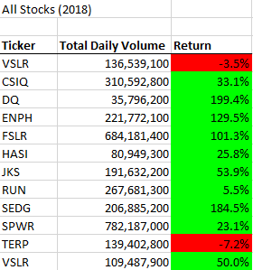

# stock-analysis

## Overview of Project

### Purpose and Background
The client, Steve, initially asked for an analysis of a handful of green energy stock tickers for his parents to invest in. With the information provided in the initial analysis, Steve helped his parents diversify their stocks and invest in higher grossing stocks than DQ alone. Now Steve has requested a refactored workbook so that he can expand the dataset to include the entire stock market over the last few years, and have his workbook run efficiently. 

## Results

## Summary
### Advantages and Disadvantages of Refactoring Code
Refactoring code increases the efficiency, either by taking fewer steps or improving the logic of the code without adding new functionality. This means that it will take less time to run and use up less memory on the device.

### Original Versus Refactored in this Dataset
